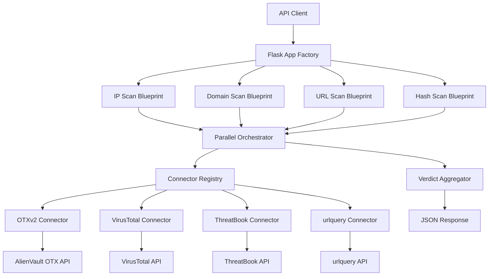
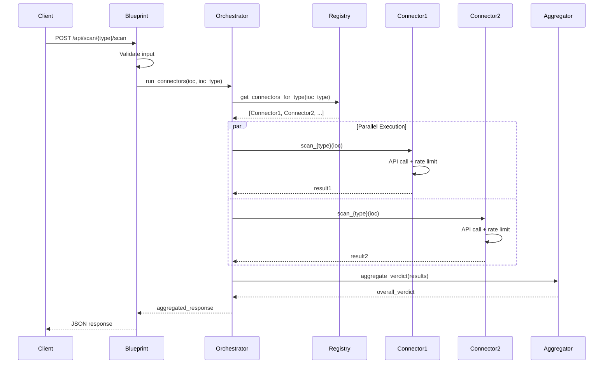

# Design Document: SentinelScan Planned Features

## Overview

This design extends the SentinelScan IoC scanning API to support three additional indicator types (domain, URL, file hash) and four new threat intelligence connectors (VirusTotal, ThreatBook, urlquery). The implementation maintains the existing blueprint architecture, parallel execution model, and connector registry pattern while adding type-specific scanning endpoints and multi-source aggregation capabilities.

The design preserves backward compatibility with the existing IP scanning functionality and follows the established patterns: Flask blueprints for each IoC type, abstract base connector interface, ThreadPoolExecutor for parallel queries, and flask-restx for API documentation.

## Architecture



## Main Algorithm/Workflow




## Components and Interfaces

### Component 1: Enhanced BaseConnector

**Purpose**: Abstract base class defining the interface for all threat intelligence connectors with support for multiple IoC types.

**Interface**:
```python
from abc import ABC, abstractmethod
from typing import Optional

class BaseConnector(ABC):
    name: str = "base"
    
    # Capability flags - override in subclasses
    supports_ip: bool = False
    supports_domain: bool = False
    supports_url: bool = False
    supports_hash: bool = False
    
    def scan_ip(self, ip: str) -> dict:
        """Scan an IPv4 address."""
        raise NotImplementedError(f"{self.name} does not support IP scanning")
    
    def scan_domain(self, domain: str) -> dict:
        """Scan a domain name."""
        raise NotImplementedError(f"{self.name} does not support domain scanning")
    
    def scan_url(self, url: str) -> dict:
        """Scan a URL."""
        raise NotImplementedError(f"{self.name} does not support URL scanning")
    
    def scan_hash(self, file_hash: str) -> dict:
        """Scan a file hash (MD5/SHA1/SHA256)."""
        raise NotImplementedError(f"{self.name} does not support hash scanning")
    
    def _error_result(self, ioc: str, ioc_type: str, exc: Exception) -> dict:
        """Generate standardized error result."""
        return {
            "source": self.name,
            "ioc": ioc,
            "ioc_type": ioc_type,
            "verdict": "unknown",
            "confidence": 0.0,
            "details": {},
            "error": str(exc),
        }
```

**Responsibilities**:
- Define standard interface for all IoC scanning methods
- Declare capability flags for connector filtering
- Provide error result standardization
- Enable graceful degradation when connector doesn't support an IoC type

### Component 2: Enhanced Connector Registry

**Purpose**: Manages connector instances and filters them by IoC type capability.

**Interface**:
```python
from typing import List, Type
from app.connectors.base import BaseConnector

class ConnectorRegistry:
    """Registry for managing and filtering threat intelligence connectors."""
    
    @staticmethod
    def get_connectors_for_type(ioc_type: str) -> List[Type[BaseConnector]]:
        """
        Filter connectors that support the specified IoC type.
        
        Args:
            ioc_type: One of 'ip', 'domain', 'url', 'hash'
            
        Returns:
            List of connector classes that support the IoC type
        """
        capability_map = {
            "ip": "supports_ip",
            "domain": "supports_domain",
            "url": "supports_url",
            "hash": "supports_hash",
        }
        
        attr = capability_map.get(ioc_type)
        if not attr:
            return []
        
        return [
            connector for connector in CONNECTORS
            if getattr(connector, attr, False)
        ]

# Global connector list
CONNECTORS: List[Type[BaseConnector]] = []
```

**Responsibilities**:
- Maintain list of all registered connectors
- Filter connectors by IoC type capability
- Enable dynamic connector discovery


### Component 3: VirusTotal Connector

**Purpose**: Integrate VirusTotal API v3 for scanning IPs, domains, URLs, and file hashes.

**Interface**:
```python
import os
import requests
from app.connectors.base import BaseConnector

class VirusTotalConnector(BaseConnector):
    name = "VirusTotal"
    supports_ip = True
    supports_domain = True
    supports_url = True
    supports_hash = True
    
    BASE_URL = "https://www.virustotal.com/api/v3"
    
    def __init__(self):
        self.api_key = os.getenv("VIRUSTOTAL_API_KEY", "")
        if not self.api_key:
            raise RuntimeError("VIRUSTOTAL_API_KEY is not set")
        self.headers = {"x-apikey": self.api_key}
    
    def scan_ip(self, ip: str) -> dict:
        """Scan IP address via VirusTotal."""
        pass
    
    def scan_domain(self, domain: str) -> dict:
        """Scan domain via VirusTotal."""
        pass
    
    def scan_url(self, url: str) -> dict:
        """Scan URL via VirusTotal."""
        pass
    
    def scan_hash(self, file_hash: str) -> dict:
        """Scan file hash via VirusTotal."""
        pass
    
    def _verdict_from_stats(self, malicious: int, suspicious: int, total: int) -> tuple[str, float]:
        """Calculate verdict from detection statistics."""
        pass
```

**Responsibilities**:
- Query VirusTotal API v3 for all IoC types
- Parse detection statistics from multiple AV engines
- Calculate verdict based on malicious/suspicious ratios
- Handle rate limiting (4 requests/minute for free tier)

### Component 4: ThreatBook Connector

**Purpose**: Integrate ThreatBook API for IP, domain, and URL reputation checks.

**Interface**:
```python
import os
import requests
from app.connectors.base import BaseConnector

class ThreatBookConnector(BaseConnector):
    name = "ThreatBook"
    supports_ip = True
    supports_domain = True
    supports_url = True
    supports_hash = False  # ThreatBook focuses on network indicators
    
    BASE_URL = "https://api.threatbook.cn/v3"
    
    def __init__(self):
        self.api_key = os.getenv("THREATBOOK_API_KEY", "")
        if not self.api_key:
            raise RuntimeError("THREATBOOK_API_KEY is not set")
    
    def scan_ip(self, ip: str) -> dict:
        """Scan IP via ThreatBook."""
        pass
    
    def scan_domain(self, domain: str) -> dict:
        """Scan domain via ThreatBook."""
        pass
    
    def scan_url(self, url: str) -> dict:
        """Scan URL via ThreatBook."""
        pass
    
    def _verdict_from_severity(self, severity: str) -> tuple[str, float]:
        """Map ThreatBook severity to standard verdict."""
        pass
```

**Responsibilities**:
- Query ThreatBook API for network indicators
- Parse threat severity and confidence scores
- Map ThreatBook-specific severity levels to standard verdicts
- Handle Chinese and international threat intelligence


### Component 5: urlquery Connector

**Purpose**: Integrate urlquery.net API for URL and domain analysis.

**Interface**:
```python
import os
import requests
from app.connectors.base import BaseConnector

class UrlQueryConnector(BaseConnector):
    name = "urlquery"
    supports_ip = False
    supports_domain = True
    supports_url = True
    supports_hash = False
    
    BASE_URL = "https://urlquery.net/api"
    
    def __init__(self):
        self.api_key = os.getenv("URLQUERY_API_KEY", "")
        if not self.api_key:
            raise RuntimeError("URLQUERY_API_KEY is not set")
    
    def scan_domain(self, domain: str) -> dict:
        """Scan domain via urlquery."""
        pass
    
    def scan_url(self, url: str) -> dict:
        """Scan URL via urlquery."""
        pass
    
    def _verdict_from_alerts(self, alerts: list) -> tuple[str, float]:
        """Calculate verdict from alert list."""
        pass
```

**Responsibilities**:
- Query urlquery API for URL/domain analysis
- Parse alert and threat indicators
- Calculate verdict from alert severity
- Handle sandbox analysis results

### Component 6: Blueprint Factory

**Purpose**: Create standardized blueprints for each IoC type with consistent routing patterns.

**Interface**:
```python
from flask import Blueprint
from flask_restx import Api, Namespace

def create_ioc_blueprint(
    name: str,
    ioc_type: str,
    description: str
) -> tuple[Blueprint, Api, Namespace]:
    """
    Factory function to create standardized IoC scanning blueprints.
    
    Args:
        name: Blueprint name (e.g., 'domain_scan')
        ioc_type: IoC type identifier (e.g., 'domain')
        description: Human-readable description
        
    Returns:
        Tuple of (Blueprint, Api, Namespace)
    """
    blueprint = Blueprint(name, __name__)
    
    api = Api(
        blueprint,
        version="1.0",
        title=f"SentinelScan {ioc_type.upper()} API",
        description=description,
        doc="/docs",
    )
    
    namespace = api.namespace(
        ioc_type,
        description=f"{ioc_type.capitalize()} scanning"
    )
    
    return blueprint, api, namespace
```

**Responsibilities**:
- Generate consistent blueprint structure for each IoC type
- Configure flask-restx API documentation
- Create namespaced routes
- Enable modular blueprint registration


### Component 7: Parallel Orchestrator

**Purpose**: Execute multiple connectors in parallel and collect results.

**Interface**:
```python
import concurrent.futures
from typing import List, Callable
from app.connectors.registry import ConnectorRegistry

class ParallelOrchestrator:
    """Orchestrates parallel execution of threat intelligence connectors."""
    
    @staticmethod
    def run_connectors(ioc: str, ioc_type: str) -> List[dict]:
        """
        Execute all applicable connectors in parallel.
        
        Args:
            ioc: Indicator of compromise value
            ioc_type: Type of IoC ('ip', 'domain', 'url', 'hash')
            
        Returns:
            List of result dictionaries from all connectors
        """
        connectors = ConnectorRegistry.get_connectors_for_type(ioc_type)
        
        if not connectors:
            return []
        
        def _scan(connector_cls):
            try:
                instance = connector_cls()
                scan_method = getattr(instance, f"scan_{ioc_type}")
                return scan_method(ioc)
            except Exception as exc:
                return connector_cls()._error_result(ioc, ioc_type, exc)
        
        with concurrent.futures.ThreadPoolExecutor(max_workers=len(connectors)) as pool:
            futures = [pool.submit(_scan, cls) for cls in connectors]
            return [f.result() for f in concurrent.futures.as_completed(futures)]
```

**Responsibilities**:
- Filter connectors by IoC type capability
- Execute scan methods in parallel via ThreadPoolExecutor
- Handle connector instantiation errors gracefully
- Collect and return all results

### Component 8: Verdict Aggregator

**Purpose**: Aggregate results from multiple sources into a single overall verdict.

**Interface**:
```python
from typing import List

class VerdictAggregator:
    """Aggregates verdicts from multiple threat intelligence sources."""
    
    VERDICT_PRIORITY = {
        "malicious": 3,
        "suspicious": 2,
        "clean": 1,
        "unknown": 0,
    }
    
    @staticmethod
    def aggregate_verdict(results: List[dict]) -> str:
        """
        Calculate overall verdict using highest-severity-wins strategy.
        
        Args:
            results: List of connector result dictionaries
            
        Returns:
            Overall verdict string
        """
        if not results:
            return "unknown"
        
        return max(
            results,
            key=lambda r: VerdictAggregator.VERDICT_PRIORITY.get(r["verdict"], 0)
        )["verdict"]
    
    @staticmethod
    def calculate_consensus(results: List[dict]) -> dict:
        """
        Calculate consensus statistics across all sources.
        
        Returns:
            Dictionary with verdict counts and percentages
        """
        if not results:
            return {}
        
        verdict_counts = {}
        for result in results:
            verdict = result["verdict"]
            verdict_counts[verdict] = verdict_counts.get(verdict, 0) + 1
        
        total = len(results)
        return {
            verdict: {
                "count": count,
                "percentage": round(count / total * 100, 1)
            }
            for verdict, count in verdict_counts.items()
        }
```

**Responsibilities**:
- Implement highest-severity-wins aggregation strategy
- Calculate consensus statistics across sources
- Handle empty result sets gracefully
- Provide verdict distribution metrics


## Data Models

### Model 1: ScanRequest (Domain)

```python
from flask_restx import fields

domain_scan_request = api.model("DomainScanRequest", {
    "domain": fields.String(
        required=True,
        description="Domain name to scan",
        example="example.com",
        pattern=r"^([a-zA-Z0-9]([a-zA-Z0-9\-]{0,61}[a-zA-Z0-9])?\.)+[a-zA-Z]{2,}$"
    )
})
```

**Validation Rules**:
- Must be valid domain format (RFC 1035)
- No protocol prefix (http://, https://)
- Maximum 253 characters
- Valid TLD required

### Model 2: ScanRequest (URL)

```python
url_scan_request = api.model("URLScanRequest", {
    "url": fields.String(
        required=True,
        description="URL to scan",
        example="https://example.com/path",
        pattern=r"^https?://[^\s/$.?#].[^\s]*$"
    )
})
```

**Validation Rules**:
- Must include protocol (http:// or https://)
- Valid URL format per RFC 3986
- Maximum 2048 characters
- Must be properly URL-encoded

### Model 3: ScanRequest (Hash)

```python
hash_scan_request = api.model("HashScanRequest", {
    "hash": fields.String(
        required=True,
        description="File hash (MD5, SHA1, or SHA256)",
        example="44d88612fea8a8f36de82e1278abb02f"
    ),
    "hash_type": fields.String(
        description="Hash algorithm (auto-detected if omitted)",
        enum=["md5", "sha1", "sha256"],
        example="md5"
    )
})
```

**Validation Rules**:
- MD5: 32 hexadecimal characters
- SHA1: 40 hexadecimal characters
- SHA256: 64 hexadecimal characters
- Auto-detect hash type from length if not specified
- Case-insensitive, normalized to lowercase

### Model 4: SourceResult (Enhanced)

```python
source_result = api.model("SourceResult", {
    "source": fields.String(
        description="Connector name",
        example="VirusTotal"
    ),
    "ioc": fields.String(
        description="Scanned indicator value",
        example="example.com"
    ),
    "ioc_type": fields.String(
        description="Type of IoC",
        enum=["ip", "domain", "url", "hash"],
        example="domain"
    ),
    "verdict": fields.String(
        description="Threat verdict",
        enum=["malicious", "suspicious", "clean", "unknown"],
        example="clean"
    ),
    "confidence": fields.Float(
        description="Confidence score (0.0 - 1.0)",
        min=0.0,
        max=1.0,
        example=0.85
    ),
    "details": fields.Raw(
        description="Source-specific metadata",
        example={
            "detections": {"malicious": 2, "suspicious": 1, "clean": 68},
            "last_analysis_date": "2024-01-15T10:30:00Z"
        }
    ),
    "error": fields.String(
        description="Error message if scan failed",
        example=None
    )
})
```

**Validation Rules**:
- source: Non-empty string
- verdict: Must be one of the four standard values
- confidence: Float between 0.0 and 1.0
- details: Flexible dictionary for source-specific data
- error: null on success, string message on failure


### Model 5: ScanResponse (Enhanced)

```python
scan_response = api.model("ScanResponse", {
    "ioc": fields.String(
        description="Scanned indicator value",
        example="example.com"
    ),
    "ioc_type": fields.String(
        description="Type of IoC",
        enum=["ip", "domain", "url", "hash"],
        example="domain"
    ),
    "overall_verdict": fields.String(
        description="Aggregated verdict (highest severity wins)",
        enum=["malicious", "suspicious", "clean", "unknown"],
        example="clean"
    ),
    "consensus": fields.Raw(
        description="Verdict distribution across sources",
        example={
            "clean": {"count": 3, "percentage": 75.0},
            "unknown": {"count": 1, "percentage": 25.0}
        }
    ),
    "sources_scanned": fields.Integer(
        description="Number of sources queried",
        example=4
    ),
    "results": fields.List(
        fields.Nested(source_result),
        description="Individual results from each source"
    ),
    "scan_timestamp": fields.DateTime(
        description="ISO 8601 timestamp of scan",
        example="2024-01-15T10:30:00Z"
    )
})
```

**Validation Rules**:
- overall_verdict: Derived from results, not user input
- consensus: Auto-calculated from results
- sources_scanned: Must match length of results array
- scan_timestamp: ISO 8601 format with timezone

### Model 6: HashType Enum

```python
from enum import Enum

class HashType(Enum):
    """Supported file hash algorithms."""
    MD5 = "md5"
    SHA1 = "sha1"
    SHA256 = "sha256"
    
    @staticmethod
    def detect_from_length(hash_value: str) -> "HashType":
        """Auto-detect hash type from string length."""
        length = len(hash_value)
        if length == 32:
            return HashType.MD5
        elif length == 40:
            return HashType.SHA1
        elif length == 64:
            return HashType.SHA256
        else:
            raise ValueError(f"Invalid hash length: {length}")
    
    @staticmethod
    def validate(hash_value: str, hash_type: "HashType") -> bool:
        """Validate hash format for given type."""
        expected_length = {
            HashType.MD5: 32,
            HashType.SHA1: 40,
            HashType.SHA256: 64,
        }
        
        if len(hash_value) != expected_length[hash_type]:
            return False
        
        # Check if all characters are hexadecimal
        try:
            int(hash_value, 16)
            return True
        except ValueError:
            return False
```

**Validation Rules**:
- Hash values must be hexadecimal strings
- Length must match algorithm specification
- Case-insensitive (normalized to lowercase)
- No special characters or whitespace


## Key Functions with Formal Specifications

### Function 1: run_connectors()

```python
def run_connectors(ioc: str, ioc_type: str) -> List[dict]:
    """Execute all applicable connectors in parallel."""
    pass
```

**Preconditions:**
- `ioc` is non-empty string
- `ioc_type` is one of: 'ip', 'domain', 'url', 'hash'
- At least one connector is registered in CONNECTORS list
- All registered connectors implement BaseConnector interface

**Postconditions:**
- Returns list of result dictionaries
- Each result contains required keys: source, ioc, ioc_type, verdict, confidence, details, error
- List length equals number of connectors supporting the IoC type
- All connectors execute in parallel (no sequential blocking)
- Failed connectors return error results (verdict='unknown', error message populated)

**Loop Invariants:**
- All completed futures contain valid result dictionaries
- No connector execution blocks other connectors
- ThreadPoolExecutor maintains max_workers constraint

### Function 2: aggregate_verdict()

```python
def aggregate_verdict(results: List[dict]) -> str:
    """Calculate overall verdict using highest-severity-wins strategy."""
    pass
```

**Preconditions:**
- `results` is a list (may be empty)
- Each result in list contains 'verdict' key
- Each verdict value is one of: 'malicious', 'suspicious', 'clean', 'unknown'

**Postconditions:**
- Returns one of: 'malicious', 'suspicious', 'clean', 'unknown'
- If results is empty, returns 'unknown'
- If any result is 'malicious', returns 'malicious'
- If no 'malicious' but any 'suspicious', returns 'suspicious'
- If all 'clean', returns 'clean'
- Priority order: malicious > suspicious > clean > unknown

**Loop Invariants:** N/A (uses max() function, not explicit loop)

### Function 3: validate_domain()

```python
def validate_domain(domain: str) -> bool:
    """Validate domain name format."""
    pass
```

**Preconditions:**
- `domain` is a string (may be empty or invalid)

**Postconditions:**
- Returns boolean value
- `true` if and only if domain matches RFC 1035 format
- `false` for empty strings, invalid characters, missing TLD
- No mutations to input parameter

**Loop Invariants:** N/A (regex validation)

### Function 4: detect_hash_type()

```python
def detect_hash_type(hash_value: str) -> HashType:
    """Auto-detect hash algorithm from string length."""
    pass
```

**Preconditions:**
- `hash_value` is non-empty string
- `hash_value` contains only hexadecimal characters

**Postconditions:**
- Returns HashType enum value (MD5, SHA1, or SHA256)
- Raises ValueError if length doesn't match any supported algorithm
- Length 32 → MD5, Length 40 → SHA1, Length 64 → SHA256
- No mutations to input parameter

**Loop Invariants:** N/A (direct length check)


### Function 5: normalize_url()

```python
def normalize_url(url: str) -> str:
    """Normalize URL for consistent scanning."""
    pass
```

**Preconditions:**
- `url` is non-empty string
- `url` contains valid URL format with protocol

**Postconditions:**
- Returns normalized URL string
- Protocol converted to lowercase (HTTP/HTTPS)
- Domain converted to lowercase
- Path preserved with original case
- Query parameters sorted alphabetically
- Fragment identifier removed
- Trailing slash normalized based on path presence

**Loop Invariants:**
- For query parameter sorting: All processed parameters maintain key-value integrity

### Function 6: calculate_consensus()

```python
def calculate_consensus(results: List[dict]) -> dict:
    """Calculate verdict distribution statistics."""
    pass
```

**Preconditions:**
- `results` is a list (may be empty)
- Each result contains 'verdict' key with valid verdict value

**Postconditions:**
- Returns dictionary mapping verdicts to count/percentage
- Sum of all counts equals len(results)
- Sum of all percentages equals 100.0 (within floating point precision)
- Empty results list returns empty dictionary
- Percentages rounded to 1 decimal place

**Loop Invariants:**
- For verdict counting: Running total never exceeds len(results)
- All processed verdicts are valid enum values

## Algorithmic Pseudocode

### Main Processing Algorithm

```python
def scan_ioc_endpoint(request_data: dict, ioc_type: str) -> tuple[dict, int]:
    """
    Main endpoint handler for IoC scanning.
    
    INPUT: request_data (validated request payload), ioc_type (string)
    OUTPUT: (response_dict, http_status_code)
    """
    # Step 1: Extract and normalize IoC value
    ioc = extract_ioc_from_request(request_data, ioc_type)
    ioc = normalize_ioc(ioc, ioc_type)
    
    # Step 2: Validate IoC format
    if not validate_ioc(ioc, ioc_type):
        return {"error": "Invalid IoC format"}, 400
    
    # Step 3: Execute connectors in parallel
    results = run_connectors(ioc, ioc_type)
    
    # Step 4: Aggregate results
    overall_verdict = aggregate_verdict(results)
    consensus = calculate_consensus(results)
    
    # Step 5: Build response
    response = {
        "ioc": ioc,
        "ioc_type": ioc_type,
        "overall_verdict": overall_verdict,
        "consensus": consensus,
        "sources_scanned": len(results),
        "results": results,
        "scan_timestamp": datetime.utcnow().isoformat() + "Z"
    }
    
    return response, 200
```

**Preconditions:**
- request_data is validated by flask-restx
- ioc_type is one of: 'ip', 'domain', 'url', 'hash'
- At least one connector supports the IoC type

**Postconditions:**
- Returns tuple of (response_dict, status_code)
- Status code is 200 on success, 400 on validation error
- response_dict contains all required fields
- All connectors have been executed
- Results are aggregated and normalized

**Loop Invariants:** N/A (sequential steps, no explicit loops)


### Parallel Connector Execution Algorithm

```python
def run_connectors(ioc: str, ioc_type: str) -> List[dict]:
    """
    Execute all applicable connectors in parallel.
    
    INPUT: ioc (string), ioc_type (string)
    OUTPUT: results (list of dicts)
    """
    # Step 1: Get connectors that support this IoC type
    connectors = ConnectorRegistry.get_connectors_for_type(ioc_type)
    
    if len(connectors) == 0:
        return []
    
    # Step 2: Define scan function for each connector
    def scan_with_connector(connector_cls):
        try:
            # Instantiate connector
            instance = connector_cls()
            
            # Get appropriate scan method
            scan_method = getattr(instance, f"scan_{ioc_type}")
            
            # Execute scan
            result = scan_method(ioc)
            
            return result
        except Exception as exc:
            # Return error result on failure
            return connector_cls()._error_result(ioc, ioc_type, exc)
    
    # Step 3: Execute all connectors in parallel
    results = []
    with ThreadPoolExecutor(max_workers=len(connectors)) as executor:
        # Submit all tasks
        futures = [executor.submit(scan_with_connector, cls) for cls in connectors]
        
        # Collect results as they complete
        for future in as_completed(futures):
            result = future.result()
            results.append(result)
    
    return results
```

**Preconditions:**
- ioc is non-empty string
- ioc_type is valid IoC type identifier
- CONNECTORS list is populated
- All connectors implement BaseConnector interface

**Postconditions:**
- Returns list of result dictionaries
- List length equals number of supporting connectors
- All connectors executed (no early termination)
- Failed connectors return error results
- Results collected in completion order (non-deterministic)

**Loop Invariants:**
- For future submission: All submitted futures correspond to valid connectors
- For result collection: All collected results are valid dictionaries
- ThreadPoolExecutor maintains max_workers constraint throughout execution

### Verdict Aggregation Algorithm

```python
def aggregate_verdict(results: List[dict]) -> str:
    """
    Calculate overall verdict using highest-severity-wins strategy.
    
    INPUT: results (list of result dicts)
    OUTPUT: verdict (string)
    """
    # Priority mapping
    PRIORITY = {
        "malicious": 3,
        "suspicious": 2,
        "clean": 1,
        "unknown": 0
    }
    
    # Handle empty results
    if len(results) == 0:
        return "unknown"
    
    # Find highest priority verdict
    max_priority = 0
    max_verdict = "unknown"
    
    for result in results:
        verdict = result["verdict"]
        priority = PRIORITY.get(verdict, 0)
        
        if priority > max_priority:
            max_priority = priority
            max_verdict = verdict
    
    return max_verdict
```

**Preconditions:**
- results is a list (may be empty)
- Each result contains 'verdict' key
- Each verdict is one of: 'malicious', 'suspicious', 'clean', 'unknown'

**Postconditions:**
- Returns string verdict
- Empty list returns 'unknown'
- Non-empty list returns highest priority verdict
- Priority order: malicious > suspicious > clean > unknown

**Loop Invariants:**
- max_priority is always the highest priority seen so far
- max_verdict corresponds to the verdict with max_priority
- All processed results have valid verdict values


### VirusTotal Scanning Algorithm

```python
def virustotal_scan_generic(ioc: str, ioc_type: str) -> dict:
    """
    Generic VirusTotal scanning algorithm for all IoC types.
    
    INPUT: ioc (string), ioc_type (string)
    OUTPUT: result (dict)
    """
    # Step 1: Determine API endpoint
    endpoint_map = {
        "ip": f"/ip_addresses/{ioc}",
        "domain": f"/domains/{ioc}",
        "url": f"/urls/{base64_urlsafe_encode(ioc)}",
        "hash": f"/files/{ioc}"
    }
    endpoint = endpoint_map[ioc_type]
    
    # Step 2: Make API request
    try:
        response = requests.get(
            f"{BASE_URL}{endpoint}",
            headers={"x-apikey": api_key},
            timeout=10
        )
        response.raise_for_status()
        data = response.json()
    except Exception as exc:
        return error_result(ioc, ioc_type, exc)
    
    # Step 3: Extract detection statistics
    stats = data.get("data", {}).get("attributes", {}).get("last_analysis_stats", {})
    malicious = stats.get("malicious", 0)
    suspicious = stats.get("suspicious", 0)
    harmless = stats.get("harmless", 0)
    undetected = stats.get("undetected", 0)
    total = malicious + suspicious + harmless + undetected
    
    # Step 4: Calculate verdict
    if total == 0:
        verdict = "unknown"
        confidence = 0.0
    elif malicious >= 3:
        verdict = "malicious"
        confidence = min(0.5 + (malicious / total) * 0.5, 1.0)
    elif malicious > 0 or suspicious > 0:
        verdict = "suspicious"
        confidence = 0.3 + ((malicious + suspicious) / total) * 0.4
    else:
        verdict = "clean"
        confidence = 0.1 + (harmless / total) * 0.2
    
    # Step 5: Build result
    return {
        "source": "VirusTotal",
        "ioc": ioc,
        "ioc_type": ioc_type,
        "verdict": verdict,
        "confidence": confidence,
        "details": {
            "detections": stats,
            "total_engines": total,
            "detection_ratio": f"{malicious}/{total}"
        },
        "error": None
    }
```

**Preconditions:**
- ioc is non-empty string
- ioc_type is one of: 'ip', 'domain', 'url', 'hash'
- api_key is valid VirusTotal API key
- Network connectivity available

**Postconditions:**
- Returns result dictionary with all required fields
- verdict is one of: 'malicious', 'suspicious', 'clean', 'unknown'
- confidence is float between 0.0 and 1.0
- On API error, returns error result with verdict='unknown'

**Loop Invariants:** N/A (sequential steps, no explicit loops)


### Hash Type Detection Algorithm

```python
def detect_hash_type(hash_value: str) -> HashType:
    """
    Auto-detect hash algorithm from string length.
    
    INPUT: hash_value (string)
    OUTPUT: hash_type (HashType enum)
    """
    # Step 1: Normalize input
    hash_normalized = hash_value.strip().lower()
    
    # Step 2: Validate hexadecimal format
    try:
        int(hash_normalized, 16)
    except ValueError:
        raise ValueError(f"Invalid hash format: not hexadecimal")
    
    # Step 3: Detect type from length
    length = len(hash_normalized)
    
    if length == 32:
        return HashType.MD5
    elif length == 40:
        return HashType.SHA1
    elif length == 64:
        return HashType.SHA256
    else:
        raise ValueError(f"Invalid hash length: {length} (expected 32, 40, or 64)")
```

**Preconditions:**
- hash_value is non-empty string

**Postconditions:**
- Returns HashType enum value (MD5, SHA1, or SHA256)
- Raises ValueError if format is invalid or length doesn't match
- Input is normalized to lowercase
- Only hexadecimal characters accepted

**Loop Invariants:** N/A (direct length check)

## Example Usage

### Example 1: Domain Scanning

```python
# Client request
POST /api/scan/domain/scan
{
    "domain": "example.com"
}

# Server processing
ioc = "example.com"
ioc_type = "domain"

# Parallel execution
results = run_connectors(ioc, ioc_type)
# Results from: OTXv2, VirusTotal, ThreatBook, urlquery

# Aggregation
overall_verdict = aggregate_verdict(results)  # "clean"
consensus = calculate_consensus(results)
# {"clean": {"count": 4, "percentage": 100.0}}

# Response
{
    "ioc": "example.com",
    "ioc_type": "domain",
    "overall_verdict": "clean",
    "consensus": {"clean": {"count": 4, "percentage": 100.0}},
    "sources_scanned": 4,
    "results": [
        {
            "source": "VirusTotal",
            "verdict": "clean",
            "confidence": 0.85,
            "details": {"detections": {"malicious": 0, "clean": 68}}
        },
        # ... other sources
    ],
    "scan_timestamp": "2024-01-15T10:30:00Z"
}
```

### Example 2: URL Scanning with Mixed Verdicts

```python
# Client request
POST /api/scan/url/scan
{
    "url": "https://suspicious-site.com/malware.exe"
}

# Parallel execution returns mixed verdicts
results = [
    {"source": "VirusTotal", "verdict": "malicious", "confidence": 0.95},
    {"source": "urlquery", "verdict": "suspicious", "confidence": 0.70},
    {"source": "ThreatBook", "verdict": "malicious", "confidence": 0.88},
    {"source": "OTXv2", "verdict": "clean", "confidence": 0.10}
]

# Aggregation (highest severity wins)
overall_verdict = aggregate_verdict(results)  # "malicious"

consensus = calculate_consensus(results)
# {
#   "malicious": {"count": 2, "percentage": 50.0},
#   "suspicious": {"count": 1, "percentage": 25.0},
#   "clean": {"count": 1, "percentage": 25.0}
# }
```

### Example 3: File Hash Scanning with Auto-Detection

```python
# Client request (hash type omitted)
POST /api/scan/hash/scan
{
    "hash": "44d88612fea8a8f36de82e1278abb02f"
}

# Auto-detect hash type
hash_type = detect_hash_type("44d88612fea8a8f36de82e1278abb02f")
# Returns: HashType.MD5 (length 32)

# Execute connectors
results = run_connectors("44d88612fea8a8f36de82e1278abb02f", "hash")
# Only VirusTotal supports hash scanning

# Response
{
    "ioc": "44d88612fea8a8f36de82e1278abb02f",
    "ioc_type": "hash",
    "overall_verdict": "malicious",
    "sources_scanned": 1,
    "results": [
        {
            "source": "VirusTotal",
            "verdict": "malicious",
            "confidence": 0.98,
            "details": {
                "detections": {"malicious": 65, "clean": 5},
                "file_type": "PE32 executable"
            }
        }
    ]
}
```


### Example 4: Error Handling - Connector Failure

```python
# One connector fails during execution
def scan_with_connector(connector_cls):
    try:
        instance = VirusTotalConnector()
        # API key invalid or rate limit exceeded
        raise requests.exceptions.HTTPError("403 Forbidden")
    except Exception as exc:
        return connector_cls()._error_result(ioc, ioc_type, exc)

# Result includes error
{
    "source": "VirusTotal",
    "ioc": "example.com",
    "ioc_type": "domain",
    "verdict": "unknown",
    "confidence": 0.0,
    "details": {},
    "error": "403 Forbidden"
}

# Other connectors continue executing
# Overall verdict calculated from successful results only
```

### Example 5: Complete Workflow - New Connector Registration

```python
# Step 1: Implement new connector
class NewThreatIntelConnector(BaseConnector):
    name = "NewThreatIntel"
    supports_ip = True
    supports_domain = True
    supports_url = False
    supports_hash = False
    
    def scan_ip(self, ip: str) -> dict:
        # Implementation
        pass
    
    def scan_domain(self, domain: str) -> dict:
        # Implementation
        pass

# Step 2: Register in registry
from app.connectors.registry import CONNECTORS
from app.connectors.new_threat_intel import NewThreatIntelConnector

CONNECTORS.append(NewThreatIntelConnector)

# Step 3: Automatic integration
# Next IP or domain scan automatically includes new connector
# URL and hash scans exclude it (supports_url=False, supports_hash=False)

# No changes needed to:
# - Blueprint routes
# - Orchestrator logic
# - Aggregation logic
# - API models
```

## Correctness Properties

### Property 1: Parallel Execution Completeness
**Universal Quantification**: ∀ connectors C supporting IoC type T, when scanning IoC value V of type T, all connectors in C execute exactly once and return a result.

**Verification**: ThreadPoolExecutor guarantees all submitted futures complete. Each connector either returns success result or error result via exception handling.

### Property 2: Verdict Priority Consistency
**Universal Quantification**: ∀ result sets R, if any result r ∈ R has verdict='malicious', then aggregate_verdict(R) = 'malicious'.

**Verification**: Priority mapping ensures malicious (priority 3) always wins over suspicious (2), clean (1), and unknown (0).

### Property 3: Consensus Accuracy
**Universal Quantification**: ∀ result sets R, sum of all verdict counts in calculate_consensus(R) equals |R|, and sum of all percentages equals 100.0.

**Verification**: Consensus calculation iterates over all results exactly once, incrementing counts. Percentages computed as (count / total) * 100.

### Property 4: IoC Type Filtering
**Universal Quantification**: ∀ connectors C and IoC type T, get_connectors_for_type(T) returns only connectors where supports_{T} = True.

**Verification**: Registry filter checks capability flag for each connector before inclusion.

### Property 5: Error Isolation
**Universal Quantification**: ∀ connectors C₁, C₂ in parallel execution, if C₁ raises exception, C₂ continues execution unaffected.

**Verification**: ThreadPoolExecutor isolates each task. Exception in one future doesn't propagate to others. Error handling wraps each connector execution.

### Property 6: Hash Type Detection Determinism
**Universal Quantification**: ∀ hash values H, detect_hash_type(H) returns the same HashType for all invocations with identical H.

**Verification**: Detection based solely on string length (deterministic). No external state or randomness.

### Property 7: Response Completeness
**Universal Quantification**: ∀ scan responses R, R contains all required fields: ioc, ioc_type, overall_verdict, consensus, sources_scanned, results, scan_timestamp.

**Verification**: Response model enforced by flask-restx schema validation. All fields populated in scan_ioc_endpoint function.

### Property 8: Confidence Bounds
**Universal Quantification**: ∀ results r, 0.0 ≤ r.confidence ≤ 1.0.

**Verification**: All connector implementations use min/max functions to clamp confidence values. Base class enforces 0.0 for error results.


## Error Handling

### Error Scenario 1: Invalid IoC Format

**Condition**: Client submits malformed IoC (e.g., invalid domain, malformed URL, non-hex hash)

**Response**: 
- HTTP 400 Bad Request
- JSON error message: `{"error": "Invalid {ioc_type} format"}`
- flask-restx validation catches format errors before route handler

**Recovery**: Client corrects input format and resubmits

### Error Scenario 2: Connector API Key Missing

**Condition**: Connector instantiation fails due to missing API key in environment

**Response**:
- Connector raises RuntimeError during __init__
- Error caught in run_connectors wrapper
- Returns error result: `{"verdict": "unknown", "error": "API_KEY is not set"}`
- Other connectors continue executing

**Recovery**: 
- System continues with remaining connectors
- Admin adds missing API key to .env
- Restart application to load new configuration

### Error Scenario 3: Connector Rate Limit Exceeded

**Condition**: Threat intelligence API returns 429 Too Many Requests

**Response**:
- requests.exceptions.HTTPError raised
- Caught by connector's try/except block
- Returns error result with verdict='unknown'
- Flask-Limiter prevents excessive requests at application level

**Recovery**:
- Result marked as unknown, doesn't affect other sources
- Client can retry after rate limit window expires
- Consider implementing exponential backoff for retries

### Error Scenario 4: Connector Network Timeout

**Condition**: API request exceeds timeout threshold (10 seconds)

**Response**:
- requests.exceptions.Timeout raised
- Caught by connector error handling
- Returns error result: `{"verdict": "unknown", "error": "Request timeout"}`
- Parallel execution ensures other connectors complete

**Recovery**:
- Timeout doesn't block other connectors
- Client receives partial results from successful connectors
- Overall verdict calculated from available results

### Error Scenario 5: No Connectors Support IoC Type

**Condition**: Client requests scan for IoC type with no registered connectors

**Response**:
- get_connectors_for_type returns empty list
- run_connectors returns empty results list
- aggregate_verdict returns 'unknown'
- Response: `{"overall_verdict": "unknown", "sources_scanned": 0, "results": []}`

**Recovery**:
- Client receives valid response indicating no sources available
- Admin can add connectors supporting the IoC type

### Error Scenario 6: All Connectors Fail

**Condition**: All connectors return error results (API failures, network issues, etc.)

**Response**:
- All results have verdict='unknown' and error messages
- aggregate_verdict returns 'unknown'
- consensus shows 100% unknown
- HTTP 200 with error details in each result

**Recovery**:
- Client can inspect individual error messages
- Client can retry after resolving issues
- System remains operational for other requests

### Error Scenario 7: Malformed API Response

**Condition**: Connector receives unexpected JSON structure from API

**Response**:
- KeyError or AttributeError raised during parsing
- Caught by connector error handling
- Returns error result: `{"verdict": "unknown", "error": "Invalid API response"}`

**Recovery**:
- Error isolated to single connector
- Other connectors provide valid results
- Consider logging for debugging


## Testing Strategy

### Unit Testing Approach

**Test Coverage Goals**: 90%+ code coverage for core logic

**Key Test Cases**:

1. **BaseConnector Tests**
   - Test capability flag inheritance
   - Test _error_result standardization
   - Test NotImplementedError for unsupported methods

2. **ConnectorRegistry Tests**
   - Test get_connectors_for_type filtering
   - Test empty registry handling
   - Test multiple connectors with mixed capabilities

3. **VerdictAggregator Tests**
   - Test priority ordering (malicious > suspicious > clean > unknown)
   - Test empty results handling
   - Test consensus calculation accuracy
   - Test percentage rounding

4. **HashType Tests**
   - Test detect_from_length for MD5 (32), SHA1 (40), SHA256 (64)
   - Test invalid length rejection
   - Test non-hexadecimal character rejection
   - Test case normalization

5. **Validation Tests**
   - Test domain format validation (RFC 1035)
   - Test URL format validation (RFC 3986)
   - Test hash format validation
   - Test edge cases (empty strings, special characters)

6. **Individual Connector Tests**
   - Mock API responses for each connector
   - Test verdict calculation logic
   - Test error handling for API failures
   - Test rate limit handling

**Testing Framework**: pytest with pytest-mock for mocking external APIs

**Example Unit Test**:
```python
def test_aggregate_verdict_malicious_wins():
    results = [
        {"verdict": "clean", "confidence": 0.9},
        {"verdict": "malicious", "confidence": 0.8},
        {"verdict": "suspicious", "confidence": 0.7}
    ]
    assert aggregate_verdict(results) == "malicious"

def test_hash_type_detection_md5():
    hash_value = "44d88612fea8a8f36de82e1278abb02f"
    assert detect_hash_type(hash_value) == HashType.MD5

def test_connector_registry_filtering():
    # Mock connectors with different capabilities
    connectors = get_connectors_for_type("domain")
    assert all(c.supports_domain for c in connectors)
```

### Property-Based Testing Approach

**Property Test Library**: Hypothesis (Python)

**Key Properties to Test**:

1. **Verdict Aggregation Commutativity**
   - Property: Order of results doesn't affect overall verdict
   - Strategy: Generate random result lists, shuffle, verify same verdict

2. **Consensus Sum Invariant**
   - Property: Sum of verdict counts always equals total results
   - Strategy: Generate random result lists, verify count sum

3. **Confidence Bounds**
   - Property: All confidence values between 0.0 and 1.0
   - Strategy: Generate random connector responses, verify bounds

4. **Hash Detection Inverse**
   - Property: Detected hash type matches expected length
   - Strategy: Generate random hex strings of valid lengths, verify detection

5. **Parallel Execution Completeness**
   - Property: Number of results equals number of supporting connectors
   - Strategy: Generate random connector sets, verify result count

**Example Property Test**:
```python
from hypothesis import given, strategies as st

@given(st.lists(st.sampled_from(["malicious", "suspicious", "clean", "unknown"])))
def test_aggregate_verdict_always_valid(verdicts):
    results = [{"verdict": v} for v in verdicts]
    overall = aggregate_verdict(results)
    assert overall in ["malicious", "suspicious", "clean", "unknown"]

@given(st.text(alphabet="0123456789abcdef", min_size=32, max_size=32))
def test_md5_detection(hash_value):
    assert detect_hash_type(hash_value) == HashType.MD5

@given(st.lists(st.floats(min_value=0.0, max_value=1.0)))
def test_confidence_bounds_preserved(confidences):
    # Simulate connector results
    results = [{"confidence": c} for c in confidences]
    for result in results:
        assert 0.0 <= result["confidence"] <= 1.0
```

### Integration Testing Approach

**Test Scenarios**:

1. **End-to-End Scan Flow**
   - Submit real IoC to API endpoint
   - Verify parallel connector execution
   - Verify response structure and content
   - Test with mocked external APIs

2. **Multi-Connector Integration**
   - Register multiple connectors
   - Verify all execute in parallel
   - Verify results aggregated correctly
   - Test with mixed success/failure scenarios

3. **Blueprint Registration**
   - Test all IoC type blueprints registered
   - Verify Swagger UI documentation generated
   - Test rate limiting across endpoints

4. **Error Propagation**
   - Test connector failure doesn't crash application
   - Verify error results included in response
   - Test graceful degradation

**Testing Framework**: pytest with Flask test client

**Example Integration Test**:
```python
def test_domain_scan_endpoint(client):
    response = client.post(
        "/api/scan/domain/scan",
        json={"domain": "example.com"}
    )
    assert response.status_code == 200
    data = response.get_json()
    assert data["ioc"] == "example.com"
    assert data["ioc_type"] == "domain"
    assert "overall_verdict" in data
    assert len(data["results"]) > 0

def test_parallel_execution_timing(client, mocker):
    # Mock connectors with 1-second delay each
    # Verify total time < 2 seconds (parallel, not sequential)
    import time
    start = time.time()
    response = client.post("/api/scan/ip/scan", json={"ip": "8.8.8.8"})
    duration = time.time() - start
    assert duration < 2.0  # Parallel execution
    assert response.status_code == 200
```


## Performance Considerations

**Parallel Execution Optimization**:
- ThreadPoolExecutor with max_workers = number of connectors
- Non-blocking I/O for API requests
- Timeout limits prevent hanging requests (10 seconds default)
- Results collected as they complete (no waiting for slowest connector)

**Rate Limiting Strategy**:
- Flask-Limiter at application level (100 requests/minute default)
- Per-connector rate limits configurable via environment variables
- Memory-based storage for development, Redis recommended for production
- Rate limits prevent API key quota exhaustion

**Caching Opportunities**:
- Consider Redis cache for recent scan results (TTL: 5-15 minutes)
- Cache key: hash(ioc + ioc_type)
- Reduces redundant API calls for frequently scanned indicators
- Improves response time for cached results

**Database Considerations**:
- Current implementation is stateless (no database)
- Future enhancement: Store scan history for trend analysis
- PostgreSQL recommended for relational scan records
- Index on (ioc, ioc_type, scan_timestamp) for efficient queries

**Expected Performance Metrics**:
- Single IoC scan: 1-3 seconds (depends on slowest connector)
- Throughput: 100 requests/minute (rate limit dependent)
- Parallel connector execution: O(1) time complexity (not O(n))
- Memory usage: Minimal (stateless, no persistent storage)


## Security Considerations

**API Key Management**:
- All API keys stored in environment variables (never hardcoded)
- .env file excluded from version control (.gitignore)
- Separate keys for development and production environments
- Rotate keys periodically (quarterly recommended)

**Input Validation**:
- flask-restx schema validation for all request payloads
- Regex patterns for domain, URL, hash formats
- Prevent injection attacks via strict format enforcement
- Maximum length limits on all input fields

**Rate Limiting**:
- Prevents abuse and DoS attacks
- Per-IP rate limiting via Flask-Limiter
- Configurable limits per endpoint
- 429 Too Many Requests response for violations

**HTTPS Enforcement**:
- All external API calls use HTTPS
- SSL certificate verification enabled
- Prevent man-in-the-middle attacks
- Production deployment should enforce HTTPS for client connections

**Error Message Sanitization**:
- Error responses don't expose internal implementation details
- API keys never included in error messages or logs
- Stack traces disabled in production mode
- Generic error messages for client-facing responses

**Dependency Security**:
- Regular dependency updates via uv
- Monitor for CVEs in third-party libraries
- Pin dependency versions in uv.lock
- Use dependabot or similar for automated security alerts

**Threat Model**:
- Attacker may submit malicious IoCs to probe system
- Attacker may attempt to exhaust API key quotas
- Attacker may try to extract API keys from responses
- Mitigation: Input validation, rate limiting, error sanitization


## Dependencies

### Existing Dependencies (Already in pyproject.toml)
- **Flask 3.0**: Web framework
- **flask-restx**: REST API with Swagger documentation
- **Flask-Limiter**: Rate limiting
- **python-dotenv**: Environment variable management
- **OTXv2**: AlienVault OTX Python SDK

### New Dependencies Required

**Core Libraries**:
- **requests**: HTTP client for API calls (likely already installed as OTXv2 dependency)
- **validators**: Domain and URL validation (alternative: use regex patterns)

**Optional Enhancements**:
- **redis**: Production-grade rate limiting storage (replace memory://)
- **pytest**: Testing framework
- **pytest-mock**: Mocking for unit tests
- **hypothesis**: Property-based testing
- **pytest-cov**: Code coverage reporting

**Connector-Specific**:
- No additional libraries required for VirusTotal, ThreatBook, urlquery (use requests)

### Environment Variables to Add

```env
# Existing
FLASK_ENV=development
FLASK_SECRET_KEY=change-me-please
OTX_API_KEY=your_otx_api_key_here
OTX_RATE_LIMIT=10

# New - VirusTotal
VIRUSTOTAL_API_KEY=your_virustotal_api_key_here
VIRUSTOTAL_RATE_LIMIT=4

# New - ThreatBook
THREATBOOK_API_KEY=your_threatbook_api_key_here
THREATBOOK_RATE_LIMIT=10

# New - urlquery
URLQUERY_API_KEY=your_urlquery_api_key_here
URLQUERY_RATE_LIMIT=5

# Optional - Redis for production
REDIS_URL=redis://localhost:6379/0
```

### API Key Acquisition

**VirusTotal**:
- Free tier: 4 requests/minute, 500 requests/day
- Sign up: https://www.virustotal.com/gui/join-us
- API documentation: https://developers.virustotal.com/reference/overview

**ThreatBook**:
- Free tier: Variable limits based on region
- Sign up: https://x.threatbook.com/
- API documentation: https://x.threatbook.com/api/

**urlquery**:
- Free tier: Limited requests
- Sign up: https://urlquery.net/
- API documentation: https://urlquery.net/api

### Deployment Considerations

**Development**:
- Use memory-based rate limiting
- Mock external APIs for testing
- Separate .env file for development keys

**Production**:
- Use Redis for distributed rate limiting
- Configure proper HTTPS/TLS
- Use production API keys with higher quotas
- Enable logging and monitoring
- Consider containerization (Docker)

